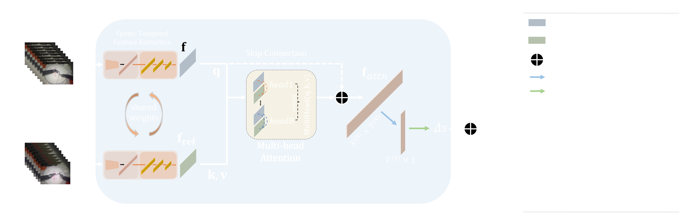

# Keep Your Eye on the Best: Contrastive Regression Transformer for Skill Assessment in Robotic Surgery
Authors: Dimitrios Anastasiou, Yueming Jin, Danail Stoyanov, and Evangelos Mazomenos

Code for the paper ["Keep Your Eye on the Best: Contrastive Regression Transformer for Skill Assessment in Robotic Surgery"](https://ieeexplore.ieee.org/abstract/document/10037203), published in IEEE Robotics and Automation Letters (RA-L).

To be presented in IROS 2023, Detroit, Michigan, USA.

### Introduction
We propose a novel video-based, contrastive
regression architecture, Contra-Sformer, for automated
surgical skill assessment in robot-assisted surgery. The proposed
framework is structured to capture the differences in the
surgical performance, between a test video and a reference video
which represents optimal surgical execution. A feature extractor
combining a spatial component (ResNet-18), supervised on
frame-level with gesture labels, and a temporal component
(TCN), generates spatio-temporal feature matrices of the test
and reference videos. These are then fed into an actionaware
Transformer with multi-head attention (A-Transformer)
that produces inter-video contrastive features at frame level,
representative of the skill similarity/deviation between the two
videos. Validated on the JIGSAWS dataset, Contra-
Sformer achieves competitive performance (Spearman Correlation 0.65 -
0.89), with a normalized mean absolute error between 5.8% -
13.4% on all tasks and across validation setups.



When optimized, Contra-Sformer generates features
that faithfully represent the similarity/deviation between the
two executions and encode information indicative of suboptimal
execution/errors, without requiring explicit error annotations.
This is validated against manual error annotations from
[1], and can be exploited for providing targeted feedback and
real-time assessment to trainees. Example video [link](https://liveuclac-my.sharepoint.com/:v:/g/personal/rmapdan_ucl_ac_uk/EQMDTsQqhpBFmnzlMPCEyuwBU8V8-ev6rAgDlh7RG6e9Ng?e=tbDXsz).

### Packages
To set up a conda environment using the provided env.yaml file, simply run:

```
conda env create -f env.yml
```

### Data preparation
We provide the extracted features from the ResNet-18 (resnet18_ftrs.zip). To request them, please send an email to <dimitrios.anastasiou.21@ucl.ac.uk>.

Also, follow this [link](https://liveuclac-my.sharepoint.com/:u:/g/personal/rmapdan_ucl_ac_uk/EdkZJGdptQ5Bpf_1YdV8z60Bwej1wQXu0FnOiq9gY_UWBA?e=4VAvbk) and download splits.zip. This file contains .csv files specifying the train and test samples along with their GRS labels for each fold of the cross-validation schemes and tasks.

Place resnet18_ftrs.zip and splits.zip in the root directory and unzip them. Then, your file structure should look like this:
```
.
├── resnet18_ftrs               # directory containing the extracted features from the ResNet-18 for every task/cross-val scheme/fold
│   ├── knot_tying
|   |   ├── loso
|   |   |    ├── 1out
|   |   |        ├── KT_B001.mat # features stored in a .mat format
|   |   |        .
|   |   |    .   .
|   |   |    .   .
|   |   |    .   └── KT_I005.mat
|   |   |     
|   |   |     
|   |   |    └── 5out
|   |   |
|   |   ├── louo
|   |   └── 4fold
|   |
│   ├── needle_passing         # same structure as above
│   └── suturing               # same structure as above
|
├── splits
│   ├── knot_tying
|   |   ├── loso
|   |   |    ├── 1out
|   |   |        ├── train.csv
|   |   |    .   └── val.csv
|   |   |    .  
|   |   |    .  
|   |   |    
|   |   |    └── 5out
|   |   ├── louo
|   |   ├── 4fold
|   |   └── ref.csv            # reference video along with its label
|   |
│   ├── needle_passing         # same structure as above
│   └── suturing               # same structure as above
|
.
.
.
└── experiment.py

```
### Models
We also provide the saved models in .pth format (download [here]((https://liveuclac-my.sharepoint.com/:u:/g/personal/rmapdan_ucl_ac_uk/EW5m3Y9J_0VLq9asQemRzEkBLcbDXryIhYJq9h4FgGaQpg?e=7mZ30A)).

### To run the code
Run experiment.py and specify the task (knot_tying,needle_passing,suturing) and the cross-validation scheme (loso,louo,4fold).

```
python experiment.py suturing loso
```
